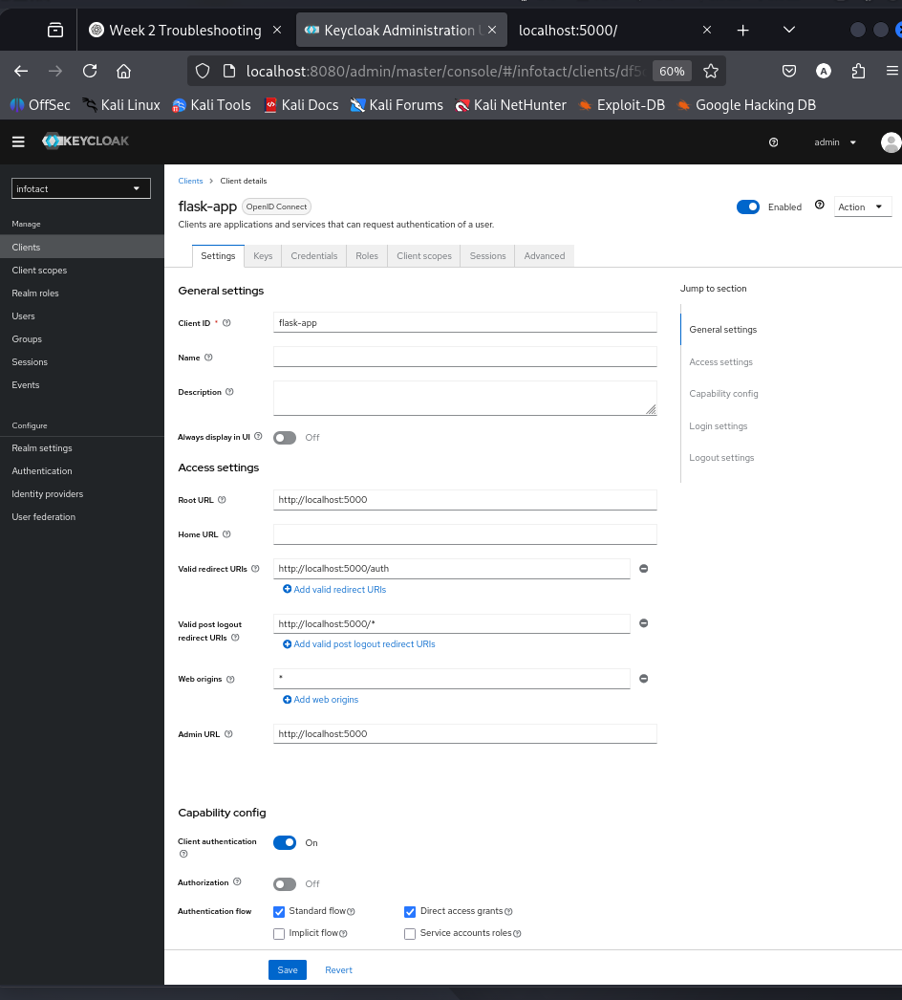
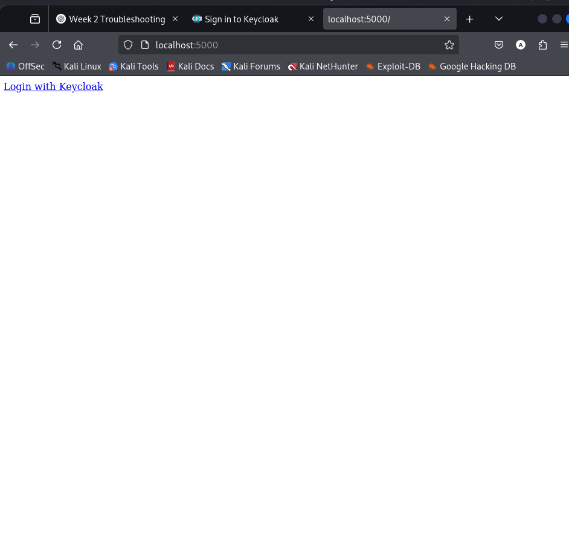
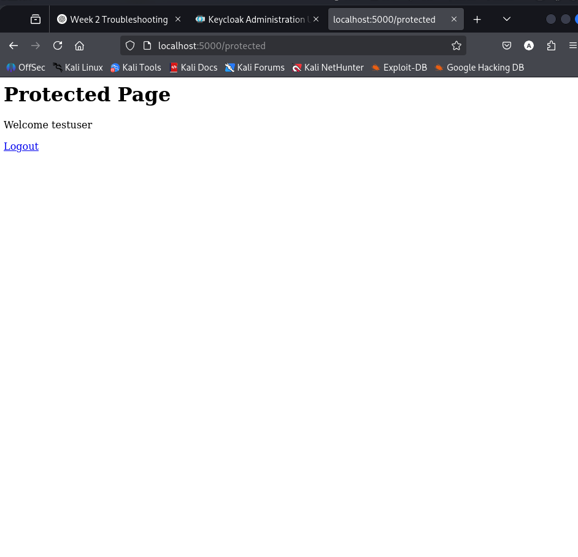
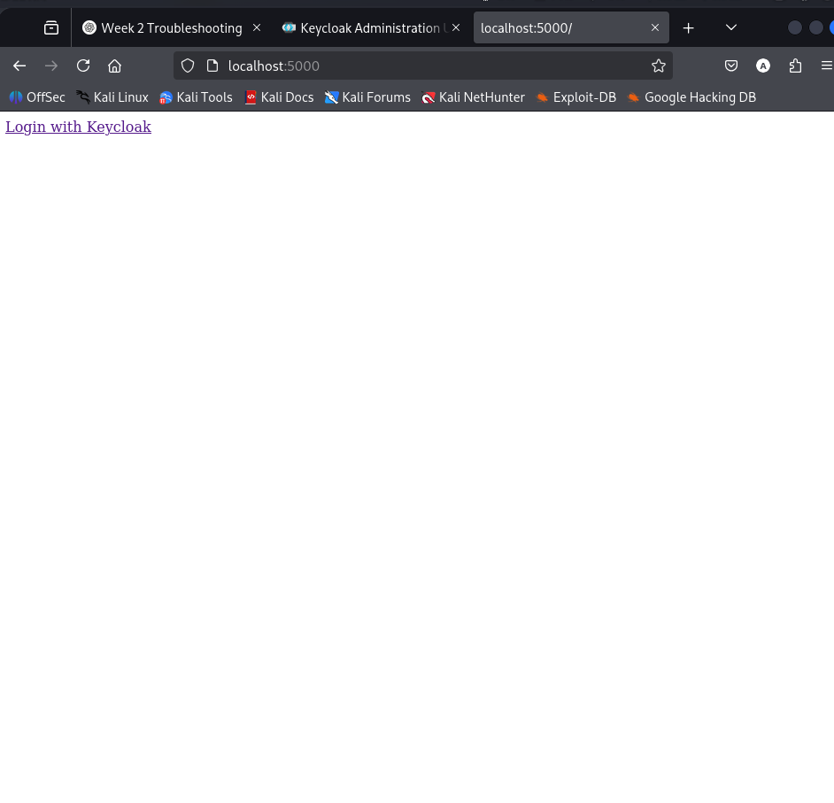

# 🔐 Week 2 – Secure Application Integration with Keycloak (OIDC)


---

## 🚀 Executive Summary

This project demonstrates secure integration of a Flask web application with **Keycloak** using the **OpenID Connect (OIDC) Authorization Code Flow**.

🎯 Objective:

- 🔧 Register an OIDC client in Keycloak  
- 🔁 Redirect authentication to Keycloak  
- 🔐 Exchange authorization codes for tokens  
- 🛡 Enforce access control on protected routes  
- 🚪 Implement standards-compliant logout  

The entire environment is fully containerized using **Docker Compose**.

---

## 🏗 Architecture Overview

The system consists of three core components:

1. 🌐 **Flask Application** – OIDC Client  
2. 🔑 **Keycloak Server** – Identity Provider (IdP)  
3. 🗄 **PostgreSQL Database** – Keycloak persistence layer  

---

## 📊 Architecture Diagram

```
+-------------------+
|     🌍 Browser    |
+-------------------+
          |
          | 1️⃣ Access protected route
          v
+-------------------+
|   🐍 Flask App    |  (Port 5000)
|   OIDC Client     |
+-------------------+
          |
          | 2️⃣ Redirect (Authorization Code Flow)
          v
+-------------------+
|    🔑 Keycloak     |  (Port 8080)
| Identity Provider |
+-------------------+
          |
          | 3️⃣ User Authentication
          v
+-------------------+
|  🗄 PostgreSQL DB  |
| (Keycloak Store)  |
+-------------------+

Flow:
➡ Authorization Request  
➡ Login  
➡ Authorization Code  
➡ Token Exchange  
➡ Protected Resource Access  
➡ OIDC Logout  
```

---

## 🔄 Authentication Flow Implemented

### 🔐 Authorization Code Flow

1️⃣ User clicks **Login with Keycloak**  
2️⃣ Flask redirects to Keycloak `/auth`  
3️⃣ User authenticates  
4️⃣ Keycloak returns authorization code  
5️⃣ Flask exchanges code for:
   - 🪪 ID Token  
   - 🎫 Access Token  
6️⃣ User session is created  
7️⃣ Protected route becomes accessible  

---

### 🚪 OIDC Logout (Keycloak 24+ Compliant)

Logout implemented using:

- `post_logout_redirect_uri`
- `id_token_hint`

✔ Local session termination  
✔ Keycloak session termination  
✔ Secure redirect validation  

---

## 🛡 Security Controls Demonstrated

- ✅ Strict redirect URI validation  
- ✅ Post logout redirect whitelisting  
- ✅ Token-based session management  
- ✅ OIDC standards compliance  
- ✅ Protection against open redirect vulnerabilities  
- ✅ Separation of concerns (IdP vs Application)  

---

## 🧰 Technologies Used

- 🐍 Python 3.10  
- 🌐 Flask  
- 🔐 Authlib (OIDC Client)  
- 🔑 Keycloak 24  
- 🗄 PostgreSQL 15  
- 🐳 Docker  
- 📦 Docker Compose  
- 🌍 OpenID Connect  
- 🔄 OAuth2 Authorization Code Flow  

---

## 📁 Project Structure

```
week-2-application-integration/
│
├── docker-compose.yml
├── README.md
│
├── screenshots/
│   ├── client-config.png
│   ├── login-redirect.png
│   ├── protected-page.png
│   └── logout-redirect.png
│
└── flask-app/
    ├── app.py
    ├── requirements.txt
    └── Dockerfile
```

---

## ⚙️ Setup & Execution

### ▶ Start Environment

```bash
docker compose up -d --build
```

---

### 🌐 Access Services

Flask Application:
```
http://localhost:5000
```

Keycloak Admin Console:
```
http://localhost:8080
```

Admin Credentials:
```
admin / admin123
```

---

## 🧪 Test Procedure

1️⃣ Navigate to Flask app  
2️⃣ Click **Login with Keycloak**  
3️⃣ Authenticate with test user  
4️⃣ Confirm redirect back to application  
5️⃣ Access protected page  
6️⃣ Logout  
7️⃣ Confirm successful redirect to public page  

---

## 📸 Screenshots

### 🔑 Keycloak Client Configuration


### 🔁 Login Redirect to Keycloak


### ✅ Successful Authentication (Protected Page)


### 🚪 Logout Redirect Validation


---

## 🎓 Learning Outcomes

This project demonstrates practical understanding of:

- 🔐 Identity & Access Management (IAM)  
- 🌍 OpenID Connect protocol internals  
- 🔄 Authorization Code Flow  
- 🛡 Secure redirect URI configuration  
- 🚪 OIDC logout requirements in modern Keycloak  
- 🐳 Container networking & service communication  
- 🧠 Real-world IAM troubleshooting  

---
