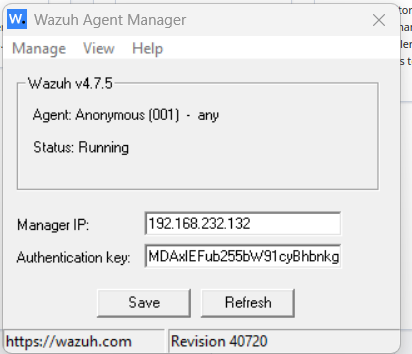
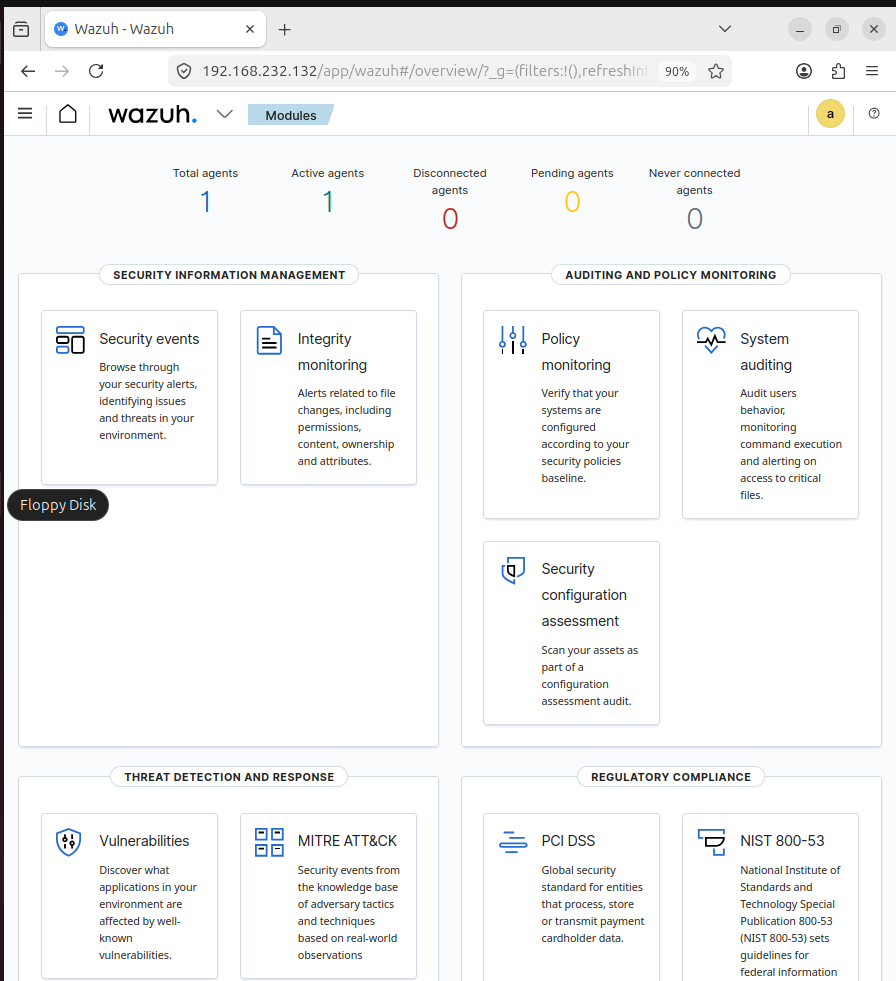
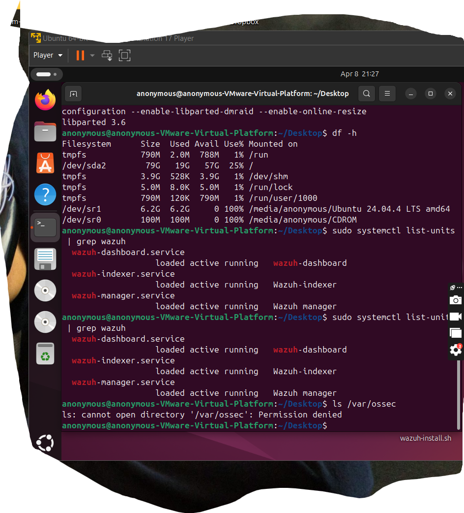
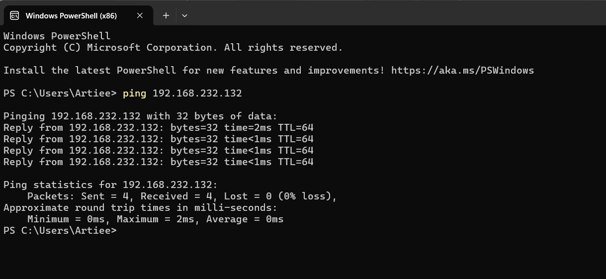

# 🛠️ Week 1 – Infrastructure and Agent Deployment

## 🎯 Objective
The objective of Week 1 was to deploy the core **Wazuh SIEM infrastructure** and connect a monitored endpoint to begin collecting security logs.

This step establishes the foundation for the **Sentient Shield EDR Grid**, allowing centralized monitoring of endpoint activity.

---

# 🏗️ Infrastructure Setup

The lab environment consists of three systems:

| System | Role |
|------|------|
| Ubuntu Server | Wazuh Manager, Indexer, and Dashboard |
| Windows Endpoint | Monitored system with Wazuh Agent + Sysmon |
| Kali Linux | Attacker machine used later for threat simulations |

The Wazuh server acts as the **central SIEM platform** responsible for collecting logs, analyzing events, and generating security alerts.

---

# ⚙️ Tasks Completed

During this phase the following tasks were performed:

- Installed **Wazuh Manager** on Ubuntu server
- Installed **Wazuh Indexer** for log storage
- Installed **Wazuh Dashboard** for security visualization
- Deployed **Wazuh Agent** on Windows endpoint
- Installed **Sysmon** for enhanced Windows logging
- Connected Windows endpoint to the Wazuh server
- Verified endpoint communication with the SIEM

---

# 📡 Agent Connectivity Verification

After installation, the Windows endpoint successfully connected to the Wazuh server and began sending security logs.

### Agent Status

---

# 📊 Wazuh Dashboard

The Wazuh dashboard provides real-time visibility into security events collected from monitored endpoints.

### Dashboard Overview

---

# 🖥️ Wazuh Services Running

All Wazuh services were verified to be running properly on the Ubuntu server.

### Wazuh Services Status

---

# 🌐 Network Connectivity Verification

Connectivity between the endpoint and the Wazuh server was verified to ensure proper communication.

### Network Connectivity

---

# ✅ Outcome

By the end of Week 1:

- The **Wazuh SIEM infrastructure was fully deployed**
- The **Windows endpoint was successfully connected**
- Security logs began flowing into the Wazuh server
- The **dashboard confirmed active monitoring**

This completes the foundational setup required for **detection engineering and threat simulations in later stages of the project**.
