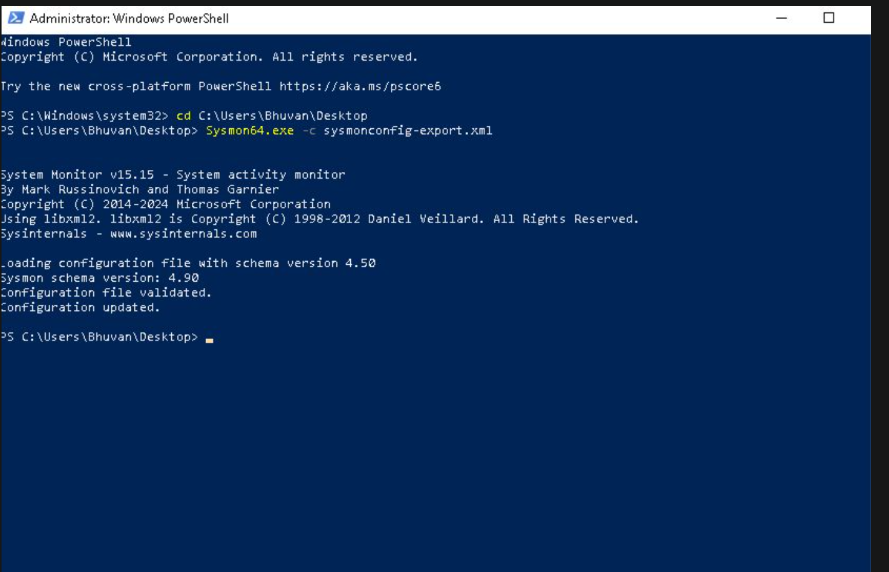
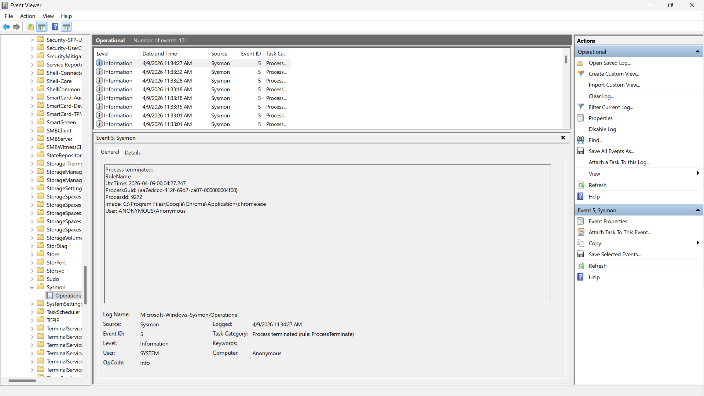
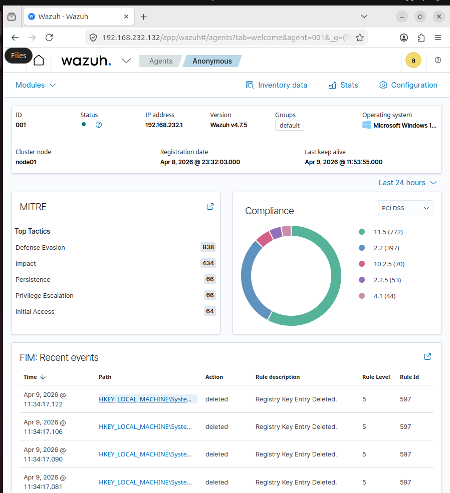

# 🔍 Week 2 – Detection Rules & Log Monitoring

## 🎯 Objective
The objective of Week 2 was to configure monitoring and detection rules within the Wazuh SIEM platform in order to identify suspicious system activities and generate security alerts.

This phase focused on enabling **File Integrity Monitoring (FIM)** and integrating **Sysmon logs from Windows endpoints** to improve visibility into system behavior.

---

# ⚙️ Tasks Completed

During this phase the following tasks were performed:

- Installed and configured **Sysmon** on the Windows endpoint
- Verified **Sysmon event logs** were being generated
- Enabled **File Integrity Monitoring (FIM)** within Wazuh
- Configured monitoring for sensitive directories
- Verified that Windows logs were being collected by Wazuh
- Tested detection by modifying monitored files
- Observed alerts generated in the Wazuh dashboard

---

# 🖥️ Sysmon Installation

Sysmon was installed on the Windows endpoint to provide enhanced logging for process creation, network connections, and file activity.

---

# 📄 Sysmon Event Logs

After installation, Sysmon began generating detailed security events that could be collected by Wazuh.

---

# 📂 File Integrity Monitoring (FIM)

Wazuh was configured to monitor sensitive directories for unauthorized file changes.  
When modifications occur, the SIEM generates alerts.

---

# 📊 Wazuh Dashboard Alerts

Security alerts triggered by monitored events were visualized through the Wazuh dashboard.

---

# 🛡️ Security Monitoring Implemented

The following monitoring capabilities were implemented:

- File modification detection
- Windows event log monitoring
- Sysmon security telemetry collection
- Security alert generation through Wazuh rules

---

# ✅ Outcome

By the end of Week 2:

- Sysmon logs were successfully collected from the Windows endpoint
- File Integrity Monitoring was operational
- Wazuh detection rules successfully generated alerts
- Security events were visualized through the SIEM dashboard

This stage significantly improved the **visibility of system activity and threat detection capability within the Sentient Shield EDR environment.**

---

# 🧠 Skills Demonstrated

- SIEM detection rule configuration
- File Integrity Monitoring implementation
- Windows event log analysis
- Sysmon integration
- Security alert validation
