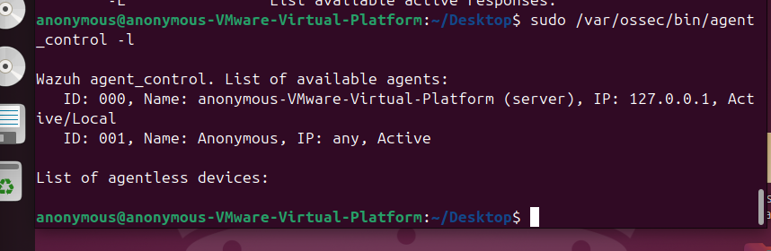
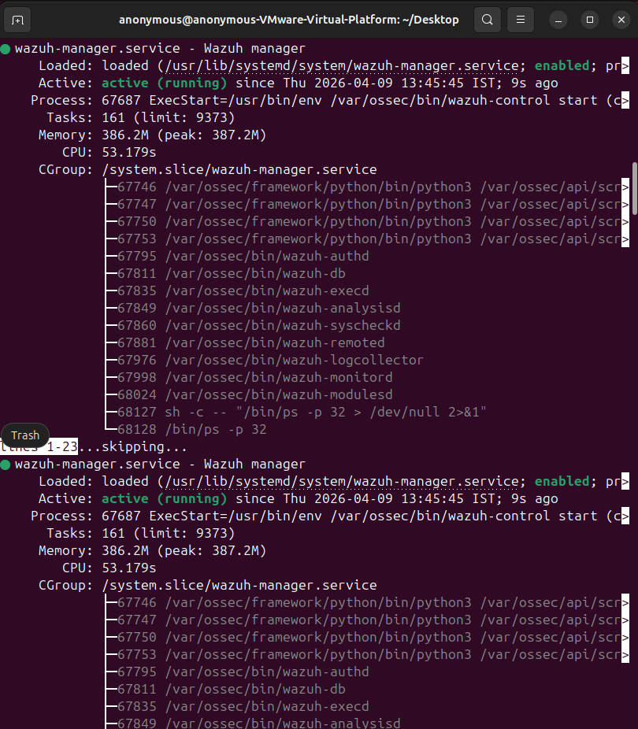
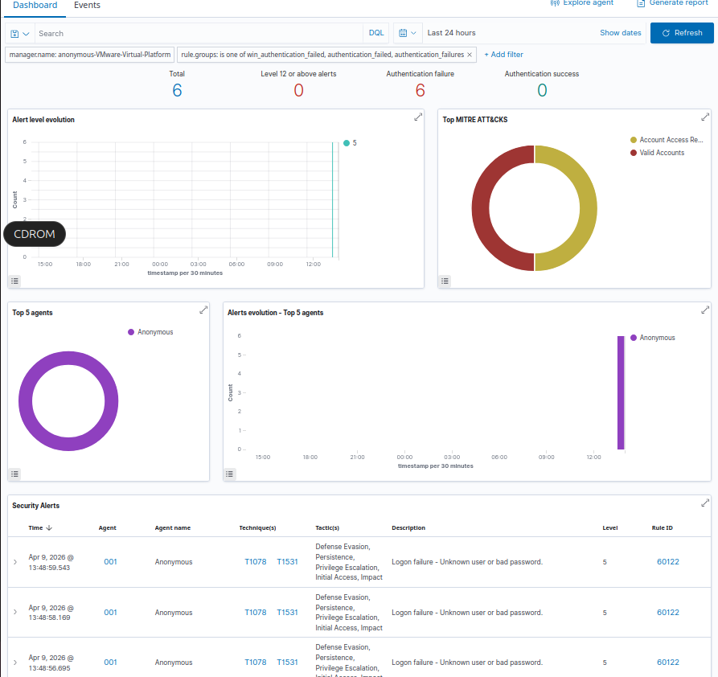
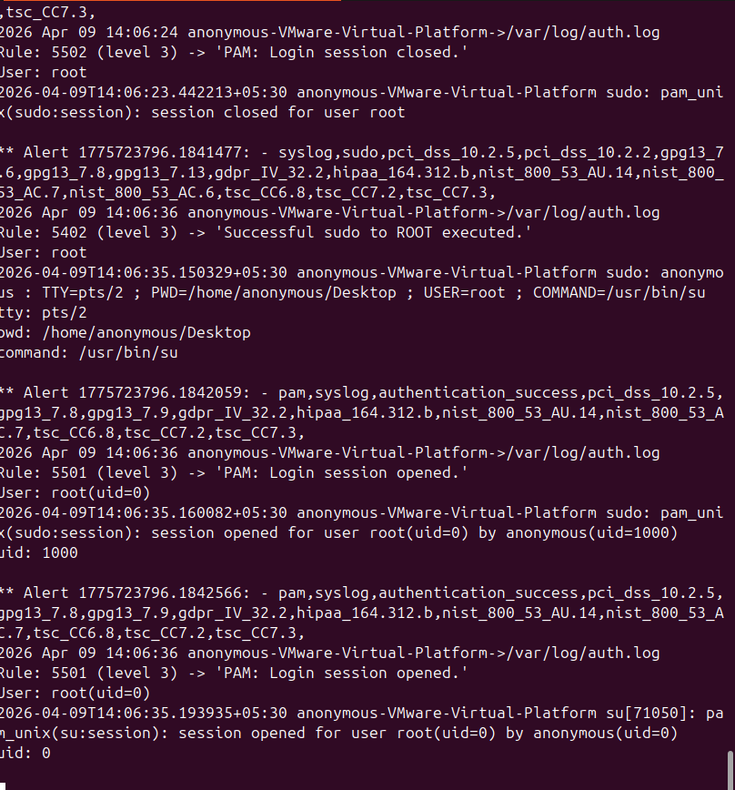

# 🛡️ Week 3 – Active Response Implementation

## 🎯 Objective
Implement automated response mechanisms using **Wazuh Active Response** to react to detected threats such as repeated authentication failures and potential brute-force attacks.

---

## 🧰 Tasks Completed

- ⚙️ Configured **Active Response rules** in Wazuh  
- 🔍 Enabled monitoring for authentication-related security events  
- 🧪 Simulated repeated login failures to trigger detection  
- 🚨 Generated **brute-force attack alerts** in the Wazuh dashboard  
- 📊 Monitored security logs to verify response execution  

---

## 📷 Detection Demonstration

### 🔗 Agent Connection Status

The Windows endpoint was successfully connected to the Wazuh manager and actively monitored.

---

### 🖥️ Wazuh Manager Service Status

The Wazuh manager service running on the Ubuntu server was verified to be active and operational.

---

### 🚨 Brute Force Detection Alert

Multiple failed authentication attempts were generated to simulate a **brute-force attack scenario**.  
Wazuh successfully detected the suspicious activity and generated alerts.

---

### 📜 Active Response Log Monitoring

Active Response mechanisms were configured to react to detected threats.  
The logs confirm that Wazuh triggered the response process after detecting repeated authentication failures.

---

## 🔐 Security Mechanisms Implemented

- 🚨 Brute-force attack detection  
- 🤖 Automated alert generation  
- 📊 Security event monitoring via Wazuh dashboard  
- ⚡ Active Response configuration for automated mitigation  

---

## 🧠 Theoretical Firewall Response

In a production deployment, Wazuh Active Response can automatically trigger defensive actions such as:

- 🔥 Blocking malicious IP addresses via firewall rules  
- ⛔ Temporarily banning suspicious hosts  
- 🛑 Preventing further authentication attempts from attackers  

This demonstrates how **Endpoint Detection and Response (EDR)** platforms move beyond monitoring into **automated threat mitigation**.

---

## ✅ Outcome

The system successfully detected repeated authentication failures and generated security alerts through Wazuh.  
This validates the ability of the EDR environment to **identify suspicious behavior and initiate automated responses**.

---

## 🧑‍💻 Skills Demonstrated

- ⚙️ Active Response configuration  
- 🔍 Threat detection validation  
- 🤖 Security automation  
- 📊 Security event monitoring with Wazuh

---

## 🏗️ Project Context

This implementation is part of the **Sentient Shield EDR Project**, where a centralized monitoring system was built using:

- 🐧 **Ubuntu (Wazuh Server)**
- 🪟 **Windows 11 (Endpoint Agent)**
- 🔎 **Sysmon for advanced logging**
- 📊 **Wazuh SIEM Dashboard**

The project demonstrates a **basic Security Operations Center (SOC) style detection and response workflow**.

---
