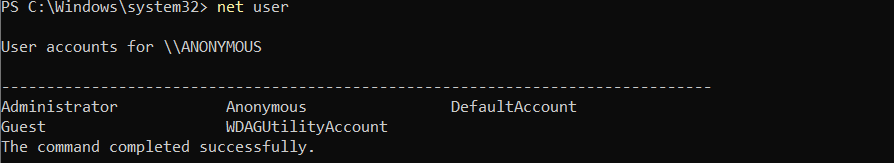
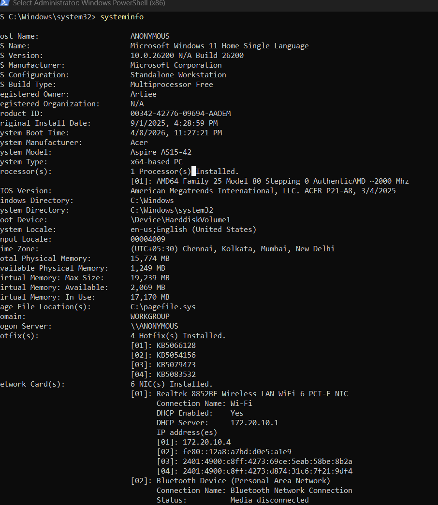

# ⚔️ Week 4 – Threat Simulation & Detection

## 🎯 Objective
The goal of this phase was to simulate common attacker behaviors on the endpoint and verify whether the **Wazuh SIEM** could detect and analyze these activities using log monitoring and detection rules.

This stage validates the **detection capability of the EDR environment** built in the previous weeks.

---

# 🧪 Threat Simulation Activities

The following attacker-like behaviors were executed on the Windows endpoint to generate security events.

---

## ⚡ Suspicious PowerShell Execution

PowerShell is frequently used by attackers for lateral movement and malicious scripting.

Command executed:

```powershell
powershell -ExecutionPolicy Bypass -Command "whoami"
```

Purpose:

- Simulates suspicious PowerShell execution
- Tests monitoring of scripting activity

📷 Screenshot  


---

## 👤 Account Discovery

Attackers often enumerate user accounts to identify targets.

Command executed:

```cmd
net user
```

Purpose:

- Simulates reconnaissance activity
- Generates command execution logs

📷 Screenshot  


---

## 🖥️ System Information Discovery

Attackers gather system information to understand the target environment.

Command executed:

```cmd
systeminfo
```

Purpose:

- Simulates system enumeration
- Generates system reconnaissance events

📷 Screenshot  


---

## 📁 Suspicious File Creation (Malware Simulation)

A fake malware file was created in a public directory to simulate a malicious drop.

Command executed:

```cmd
echo malware > C:\Users\Public\malware.exe
```

Purpose:

- Simulates malware staging behavior
- Tests file monitoring and suspicious activity detection

📷 Screenshot  


---

# 🚨 Alerts Observed in Wazuh

During the simulation, the SIEM generated alerts corresponding to the executed commands.

Detected activities included:

- PowerShell command execution
- User account enumeration
- System information discovery
- Suspicious file creation
- Security rule triggers

These alerts demonstrate how **endpoint activity is monitored and analyzed centrally**.

---

# 🧠 MITRE ATT&CK Mapping

The simulated actions correspond to common attacker techniques in the **MITRE ATT&CK framework**.

| Technique | Description |
|--------|-------------|
| T1059 | Command and Scripting Interpreter (PowerShell) |
| T1087 | Account Discovery |
| T1082 | System Information Discovery |
| T1105 | Malware Staging / File Drop |

Mapping alerts to MITRE ATT&CK helps analysts understand **attacker behavior and investigation context**.

---

# 📊 Detection Workflow

The following process occurred during the simulation:

```
Attacker Command
       │
       ▼
Windows Endpoint Logs
       │
       ▼
Wazuh Agent
       │
       ▼
Wazuh Manager
       │
       ▼
Detection Rules Triggered
       │
       ▼
Security Alerts in Dashboard
```

This demonstrates a simplified **Security Operations Center (SOC) detection workflow**.

---

# ✅ Outcome

The simulated attack behaviors successfully generated multiple alerts within the Wazuh SIEM.

This confirms that the monitoring infrastructure can:

- Detect suspicious command execution
- Monitor endpoint activity
- Trigger security alerts
- Support investigation of potential threats

---

# 🧑‍💻 Skills Demonstrated

- Threat simulation
- Security event analysis
- MITRE ATT&CK mapping
- SIEM alert investigation
- Endpoint activity monitoring

---

# 🏗️ Project Context

This exercise is part of the **Sentient Shield EDR Project**, which demonstrates the creation of a small-scale detection environment using:

- Ubuntu (Wazuh Server)
- Windows 11 (Endpoint Agent)
- Sysmon for enhanced logging
- Wazuh SIEM for monitoring and detection

The project simulates how **real Security Operations Centers detect and investigate attacker behavior**.
